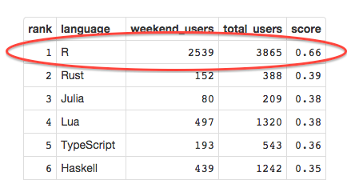

<style>
em { font-style: italic; }
strong { font-weight: bold; }
</style>

## What's an interesting language to study?

<br />

Perhaps:

* One which people are using on GitHub.
* One which people are playing with in their spare time (on the weekend).
* One with a decently active community -- not too fringe.

<br />
<br />

<center>
**This calls for an app!**
</center>

---

## Method

* Take 1 month of recent events.
* Aggregate the number of users pushing to repos of each language.
* Filter out very fringe languages (hard to extrapolate).


```r
data <- read.table('../counts.txt', sep=',', comment.char='', header=TRUE)
head(data[data$week == 1 & data$total_users >= 200,])
```

```
##     week    language weekend_users total_users
## 20     1        VimL           964        3756
## 25     1        Ruby          5175       18176
## 76     1      Groovy           218         784
## 82     1        Perl           583        2210
## 129    1        Rust           125         311
## 148    1 Common Lisp            63         200
```

---

## Scoring

* Raw counts aren't interesting. Of course Javascript is at the top!
* Normalize weekend counts by full-week counts to get a "weekendiness" score.


```r
slice <- data[data$week == 1 & data$total_users >= 200,]
slice$score <- slice$weekend_users / slice$total_users
head(slice[order(-slice$score),])
```

```
##     week   language weekend_users total_users  score
## 129    1       Rust           125         311 0.4019
## 649    1 Processing           135         362 0.3729
## 383    1        Lua           480        1307 0.3673
## 500    1    Haskell           425        1234 0.3444
## 434    1     Scheme            75         223 0.3363
## 372    1 TypeScript           200         598 0.3344
```

* All these languages look pretty interesting!

---

## Am I normal?

And look, R is #1 in 2 of the 4 weeks of June.



So creating data presentations in R might be a totally normal thing to do on the
weekend. **Yes!**
